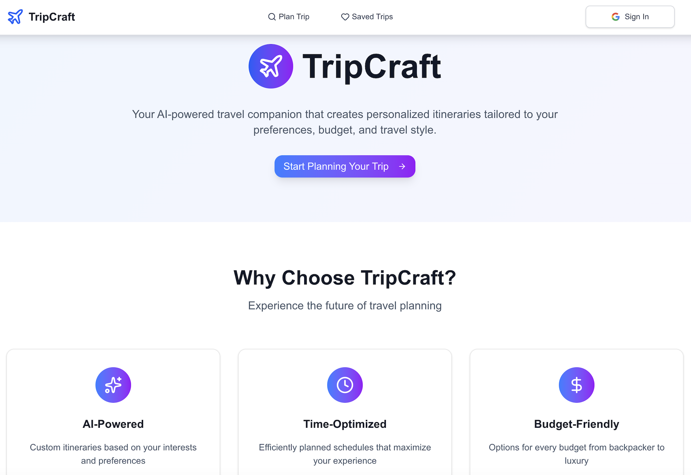
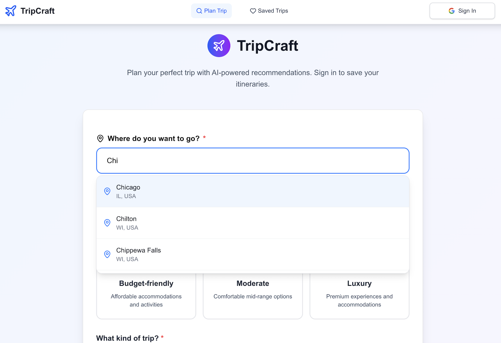
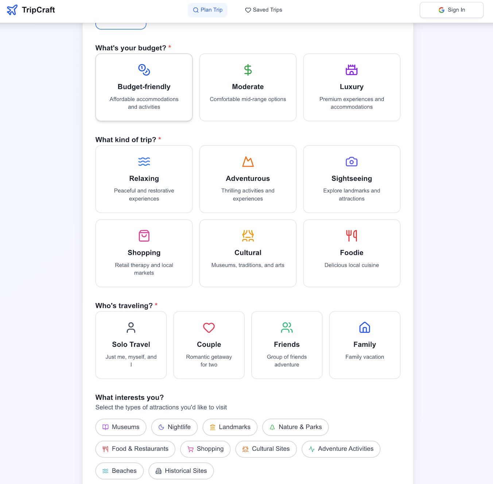
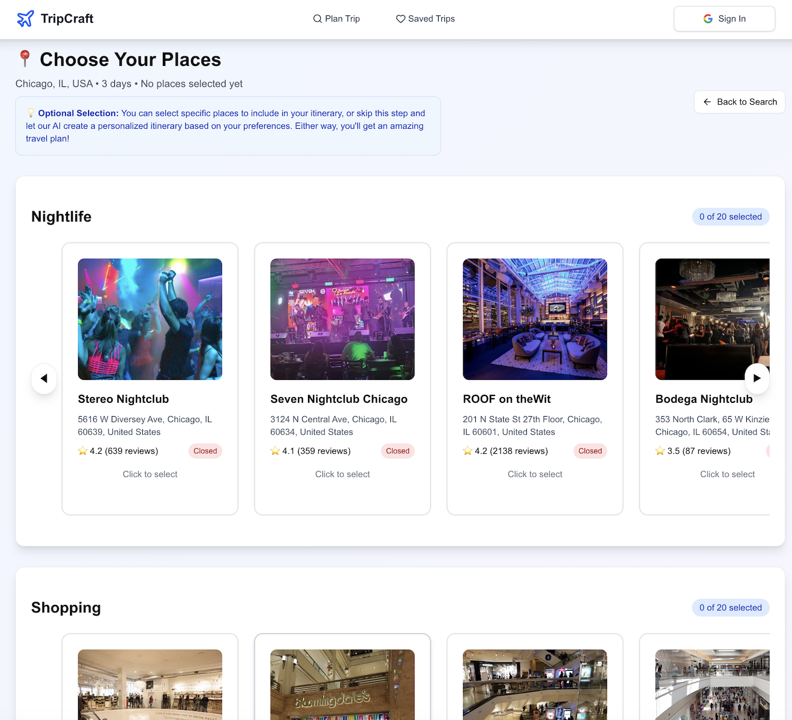
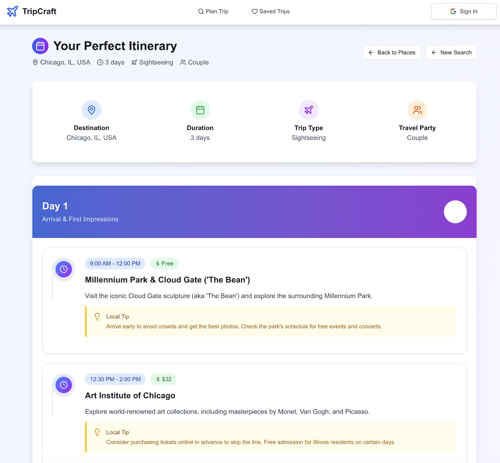
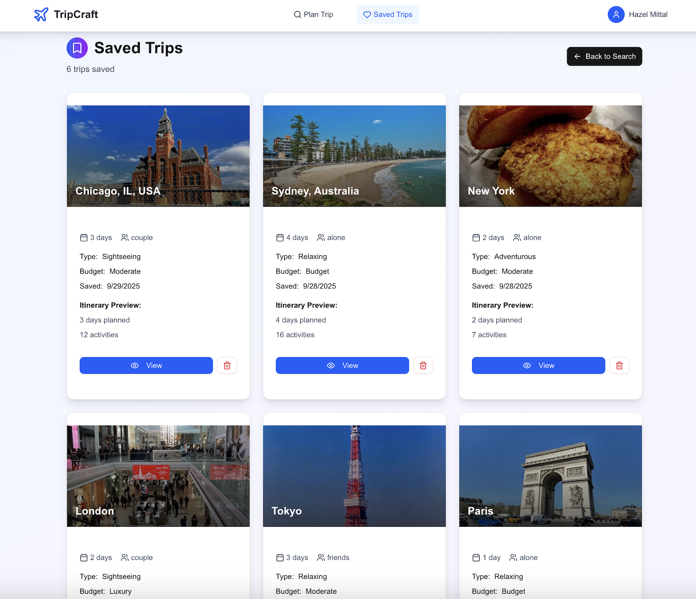

# ✈️ TripCraft - AI-Powered Travel Planner

**TripCraft** is an intelligent travel planning application that creates personalized itineraries using AI and real-time data from Google Places API. Plan your perfect trip with custom recommendations, save your itineraries, and discover amazing places around the world.

   

## 🌟 Features

### **AI-Powered Itinerary Generation**
- **Smart Planning**: Uses Google Gemini AI to create detailed, day-by-day itineraries
- **Personalized Recommendations**: Tailored suggestions based on your preferences, budget, and travel style
- **Real-time Data**: Integrates with Google Places API for accurate, up-to-date information

### **Intelligent Place Discovery**
- **Autocomplete Search**: Google Places Autocomplete for destination input
- **Categorized Results**: Places organized by interests (Nature, Culture, Food, etc.)
- **Location-Aware**: Biased search results to your chosen destination
- **Rich Media**: High-quality photos from Google Places API

### **User Experience**
- **Google Sign-In**: Secure authentication with Firebase
- **Save & Manage**: Store your favorite itineraries in the cloud
- **Multi-page Flow**: Intuitive navigation between search, places, and itinerary pages

## 📱 Demo Screenshots

<div align="center">
  <table>
    <tr>
      <td align="center" width="33%">
        
        <br><strong>1. Homepage</strong>
      </td>
      <td align="center" width="33%">
        
        <br><strong>2. Search Page: Destination</strong>
      </td>
      <td align="center" width="33%">
        
        <br><strong>3. Search Page: Trip type/prefrences</strong>
      </td>
    </tr>
    <tr>
      <td align="center" width="33%">
        
        <br><strong>4. Choose Places</strong>
      </td>
      <td align="center" width="33%">
        
        <br><strong>5. AI Itinerary</strong>
      </td>
      <td align="center" width="33%">
        
        <br><strong>6. Saved Trips</strong>
      </td>
    </tr>
  </table>
</div>

## 🏗️ Architecture

### **Frontend** (Next.js)
- **Framework**: Next.js 15.3.4 with Pages Router
- **Styling**: Tailwind CSS with custom components
- **Authentication**: Firebase Auth with Google Sign-In

### **Backend** (FastAPI)
- **Framework**: FastAPI with Python
- **AI Integration**: Google Gemini 2.0 Flash for itinerary generation
- **APIs**: Google Places API for place search and photos

### **Database** (Firebase)
- **Authentication**: Firebase Auth for user management
- **Storage**: Firestore for saving user itineraries
- **Security**: User-based data isolation

## 🚀 Quick Start

### Prerequisites
- **Node.js** (v18 or higher)
- **Python** (v3.8 or higher)
- **Google Cloud Platform** account for APIs
- **Firebase** project for authentication and storage

### 1. Clone the Repository
```bash
git clone https://github.com/hazel-mittal/TripCraft.git
cd AI-Travel-Planner
```

### 2. Backend Setup
```bash
cd backend
python -m venv venv
source venv/bin/activate  # On Windows: venv\Scripts\activate
pip install -r requirements.txt
```

### 3. Frontend Setup
```bash
cd frontend/ai-travel-planner
npm install
```

### 4. Environment Configuration

#### Backend (.env)
```env
GOOGLE_API_KEY=your_google_places_api_key
GEMINI_API_KEY=your_gemini_api_key
```

#### Frontend (.env.local)
```env
NEXT_PUBLIC_FIREBASE_API_KEY=your_firebase_api_key
NEXT_PUBLIC_FIREBASE_AUTH_DOMAIN=your_project.firebaseapp.com
NEXT_PUBLIC_FIREBASE_PROJECT_ID=your_project_id
NEXT_PUBLIC_FIREBASE_STORAGE_BUCKET=your_project.appspot.com
NEXT_PUBLIC_FIREBASE_MESSAGING_SENDER_ID=your_sender_id
NEXT_PUBLIC_FIREBASE_APP_ID=your_app_id
NEXT_PUBLIC_GOOGLE_PLACES_API_KEY=your_google_places_api_key
```

### 5. Run the Application
```bash
# Terminal 1: Backend
cd backend
source venv/bin/activate
uvicorn main:app --reload --host 0.0.0.0 --port 8000

# Terminal 2: Frontend
cd frontend/ai-travel-planner
npm run dev
```

Visit `http://localhost:3000` to see TripCraft in action! 🎉

## 📱 How It Works

### 1. **Plan Your Trip**
- Enter your destination with autocomplete suggestions
- Select your budget (Budget-friendly, Moderate, Luxury)
- Choose your trip type (Adventure, Relaxing, Cultural, etc.)
- Pick your travel party (Solo, Couple, Family, Friends)
- Select your interests (optional)

### 2. **Discover Places**
- Browse AI-curated places by category
- Select specific places to include (optional)
- Let AI surprise you with recommendations

### 3. **Get Your Itinerary**
- Receive a detailed day-by-day plan
- See activities with times, costs, and tips
- Save your itinerary to your account

### 4. **Manage Your Trips**
- Access all saved itineraries
- View trip details and photos
- Sign in from any device to access your trips

## 🛠️ API Endpoints

### Backend (FastAPI)
- `POST /api/search` - Search for places by destination and interests
- `POST /api/itinerary` - Generate AI-powered itinerary
- `POST /api/autocomplete` - Get destination autocomplete suggestions
- `POST /api/destination-photo` - Fetch destination photos

### Frontend (Next.js)
- `/` - Homepage with features and call-to-action
- `/search` - Trip planning form
- `/places` - Place selection and browsing
- `/itinerary` - Generated itinerary display
- `/saved-trips` - User's saved itineraries

## 🔧 Configuration

### Google APIs Setup
1. **Google Places API**: Enable for place search and photos
2. **Google Gemini API**: Enable for AI itinerary generation
3. **Geocoding API**: Enable for location-based search bias

### Firebase Setup
1. Create a Firebase project
2. Enable Authentication (Google provider)
3. Create Firestore database
4. Set up security rules for user data
5. Create composite index: `trips` collection with `userId` and `createdAt`


## 🔒 Security & Privacy

- **Authentication**: Secure Google OAuth integration
- **Data Isolation**: User data is isolated by Firebase UID
- **API Keys**: Environment variables for secure key management
- **CORS**: Properly configured for development and production
- **Input Validation**: Client and server-side validation

---

**Happy Traveling with TripCraft! ✈️🌍**
